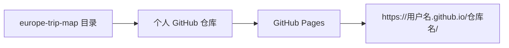

# 用个人 GitHub Pages 分享路程图

这份图是纯静态页面（`index.html` + `css` / `js` / `data`）。浏览器打开后再去拉 Leaflet 和 Esri 底图，不需要服务器、不需要 AWS。用**个人 GitHub** 的 Pages 发一个链接给同行人即可。

本文只说明怎么发布，不替你执行 `git push`（远程仓库在你的个人账号上，需要你自己登录）。



---

## 发布范围（先看这一节）

**只发布本目录。** 把 `europe-trip-map/` 当作仓库根目录，根上直接是 `index.html`。

可以提交的文件：

- `index.html`
- `css/`
- `js/`
- `data/`
- 本文件（可选）

不要提交、也不要放到这个仓库里：

- 上一层 `assets` 里的行程终版 Markdown
- `预定信息`、`归档`、门票相关文件夹
- 护照、订单截图、机票 PDF

仓库根必须是本目录，这样 Pages 地址才是：

`https://<你的用户名>.github.io/europe-trip-2026-map/`

如果把整个 `assets` 推上去，地址会变成 `.../europe-trip-map/`，而且行程原文会公开。

---

## 1. 在个人账号建仓库

1. 退出公司 GitHub 组织账号，登录**个人账号**（头像下能看到的是你的个人用户名，不是公司组织）。
2. 打开 [https://github.com/new](https://github.com/new)。
3. Repository name 填 `europe-trip-2026-map`（或你喜欢的名字，后面命令里改成一致即可）。
4. 选 **Public**（免费个人账号的 Pages 只能挂公开仓库，见文末「隐私」）。
5. **不要**勾选 Add a README / .gitignore / license，保持空仓库。
6. 点 Create repository。

确认 Owner 是个人用户名，不是公司组织。

---

## 2. 只把地图目录推上去

在终端执行（把 `<你的用户名>` 换成个人 GitHub 用户名）：

```bash
cd "/Users/vr-999/Downloads/assets/europe-trip-map"

git init
git add index.html css js data
git commit -m "发布十一欧洲行程路程图"
git branch -M main
git remote add origin git@github.com:<你的用户名>/europe-trip-2026-map.git
git push -u origin main
```

如果本目录里已经有过 `git init`，`git init` 可以跳过。若 `remote add` 报 already exists，改用：

```bash
git remote set-url origin git@github.com:<你的用户名>/europe-trip-2026-map.git
git push -u origin main
```

HTTPS 也可以，把 `origin` 换成：

`https://github.com/<你的用户名>/europe-trip-2026-map.git`

推送前用 `git status` 看一眼：暂存区里不该出现 `../` 或行程 Markdown。

---

## 3. 打开 GitHub Pages

1. 打开仓库 → **Settings** → 左侧 **Pages**。
2. Build and deployment 里 Source 选 **Deploy from a branch**。
3. Branch 选 `main`，目录选 **`/ (root)`**，点 Save。
4. 等 1–2 分钟，同一页顶部会出现地址。

标准地址：

`https://<你的用户名>.github.io/europe-trip-2026-map/`

日期锚点仍然可用，发给同行人时可以直接带到某一天：

- `https://<你的用户名>.github.io/europe-trip-2026-map/#0927`
- `https://<你的用户名>.github.io/europe-trip-2026-map/#0929A`
- `https://<你的用户名>.github.io/europe-trip-2026-map/#1004`

对方只需要浏览器，不用有 GitHub 账号。手机也能开；横屏看总览更清楚。

### 怎么确认不是公司站点

- 地址主机名是 `<个人用户名>.github.io`，不是公司组织名。
- 仓库页面左上角 Owner 是个人头像 / 个人用户名。
- 若误推到公司组织：在组织仓库 Settings 里不要开 Pages，回到个人账号按第 1–3 步重做一遍。

---

## 4. 以后改了地图怎么更新

改完 `js/data.js`、路线或样式后，仍在本目录执行：

```bash
cd "/Users/vr-999/Downloads/assets/europe-trip-map"
git add index.html css js data
git status
git commit -m "更新路程图"
git push
```

Pages 一般一两分钟后自动更新。浏览器若还是旧版，强制刷新一次（Mac 上 Cmd + Shift + R）。

---

## 隐私

免费个人 GitHub 的 Pages **只能挂在公开仓库**。知道链接的人都能打开，搜索引擎也可能收录。图上有住宿地址和已订场次，发给同行人前默认接受这一点。

可选、不默认做：

- 仓库名加一段不好猜的后缀，例如 `europe-trip-2026-map-x7k2`，只把完整链接发给同行人。
- 仓库 Settings → General 里，能关的社交预览 / 不必要的 Discoverability 就关掉（公开仓库本身仍可被打开）。
- 个人 [GitHub Pro](https://github.com/pricing) 才能把 Pages 挂到**私有**仓库。
- 以后若要口令访问，再在个人 Cloudflare 前面加 Access；这不是当前主流程。

---

## 可选：自定义域名

不必须。若你有自己的域名，在仓库 Settings → Pages → Custom domain 填入主机名（例如 `trip.example.com`），再到域名 DNS 加 GitHub 提示的 CNAME / A 记录。证书由 GitHub 签发，一般几分钟到几小时。没有域名就用 `*.github.io` 链接即可。
